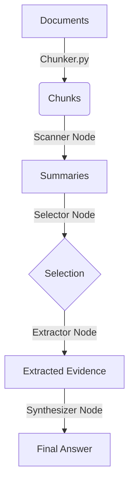

# Silas V2 - Hierarchical RAG Agent 🧠


**Silas V2** is a document analysis agent utilizing a **Hierarchical RAG** (Retrieval-Augmented Generation) architecture. Unlike classic RAG approaches that rely on vector search (embeddings), Silas performs surgical text analysis by cutting, scanning, and selecting relevant "chunks".

Designed to run **100% locally** with [Ollama](https://ollama.com/).

## 🚀 Why "Hierarchical"?

Standard RAG often retrieves entire documents or imprecise fragments. Silas mimics the human reading process through successive filtering stages:

1.  **Chunking**: Intelligent text segmentation based on natural boundaries.
2.  **Scanning**: Rapid summary of every segment (Fast Model).
3.  **Selection**: Selection of relevant segments based on summaries (Reasoning Model).
4.  **Extraction**: Deep reading of *only* the selected segments.
5.  **Synthesis**: Drafting the final answer with citations.

## 🛠️ Installation

### Prerequisites
- Python 3.9+
- [Ollama](https://ollama.com/) installed and running.

### 1. Clone the repository
```bash
git clone [https://github.com/GaetanAff/silas-hierarchical-rag.git](https://github.com/GaetanAff/silas-hierarchical-rag.git)
cd silas-hierarchical-rag
```

### 2. Install dependencies
```bash
python -m venv venv
source venv/bin/activate  # On Windows: venv\Scripts\activate
pip install -r requirements.txt
```

### 3. Setup Ollama Models
Silas uses three model sizes to optimize the cost/performance ratio (defaulting to the Qwen 3 family). Make sure to pull them:
```bash
ollama pull qwen3:0.6b   # For rapid scanning (FAST_MODEL)
ollama pull qwen3:8b     # For selection logic (CHOOSE_MODEL)
ollama pull qwen3:14b    # For extraction/synthesis (SMART_MODEL)
```
Note: You can change the model names in config.py.

## 💻 Usage

Silas is a command-line interface (CLI) tool. You must provide a question and a directory containing your documents.

### Basic Command

```bash
python main.py --question "What are the key conclusions?" --directory ./inputs/
```

### Arguments

| Argument | Short | Description | Required |
|----------|-------|-------------|----------|
| `--question` | `-q` | The question you want to ask your documents. | ✅ Yes |
| `--directory` | `-d` | Path to the folder containing your files (pdf, txt, md, etc.). | ✅ Yes |
| `--verbose` | `-v` | Enables verbose mode to display the agent's reasoning steps. | ❌ No |

### Examples

**1. Summarize a project:**

```bash
python main.py -q "Summarize the project architecture" -d ./docs/
```

**2. Extract specific data with verbose logs:**

```bash
python main.py -q "What is the deadline mentioned in the contract?" -d ./contracts/ -v
```

## ⚙️ Configuration

You can tweak the agent's behavior in `config.py`:

| Parameter | Description | Default |
|-----------|-------------|---------|
| `CHUNK_SIZE` | Target size of text segments (chars) | 1500 |
| `CHUNK_OVERLAP` | Overlap between chunks to preserve context | 200 |
| `SMART_MODEL` | Model for final answer generation | qwen3:14b |
| `FAST_MODEL` | Model for high-speed scanning | qwen3:0.6b |

## 🏗️ Architecture Flow



## 📄 License

This project is licensed under the MIT License - see the LICENSE file for details.
