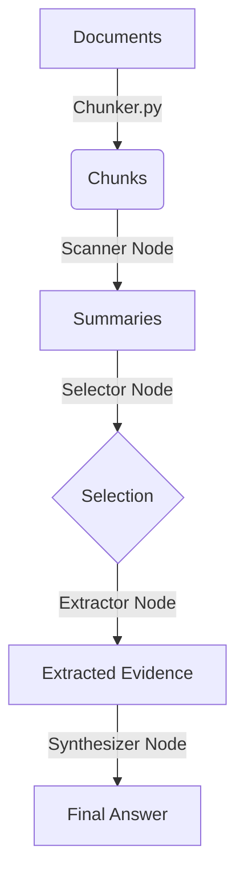

# Silas - Hierarchical RAG Agent 🧠


**Silas** is an intelligent document analysis agent built on a **Hierarchical RAG** (Retrieval-Augmented Generation) architecture. It enables you to query large collections of documents and receive precise, well-cited answers.

Unlike traditional RAG systems that rely on vector databases and semantic embeddings, Silas takes a different approach: it performs **surgical text analysis** by intelligently segmenting documents into chunks, scanning them with a fast model, and progressively filtering down to only the most relevant passages. This hierarchical filtering mimics how a human researcher would skim through documents before deep-reading specific sections.

### Key Features

- **Scalable document processing**: Handle dozens of documents (PDF, TXT, Markdown, etc.) in a single query.
- **Precise citations**: Every claim in the final answer is backed by a specific chunk reference (`[document_s3: extracted passage]`), so you can trace exactly where the information comes from.
- **No vector database required**: No need to set up embeddings, ChromaDB, or Pinecone. Silas uses pure LLM-based filtering.
- **Cost-efficient multi-model pipeline**: Uses small, fast models for bulk scanning and reserves large, powerful models only for final extraction and synthesis.
- **100% local and private**: Runs entirely on your machine using [Ollama](https://ollama.com/) as the inference backend. Your documents never leave your computer.

### Built With

- **[LangGraph](https://github.com/langchain-ai/langgraph)**: Orchestrates the multi-step pipeline as a stateful graph, enabling clean separation between chunking, scanning, selection, extraction, and synthesis nodes.
- **[Ollama](https://ollama.com/)**: Serves local LLMs (Qwen, Llama, Mistral, etc.) with a simple API. Silas defaults to the Qwen 3 family for its excellent performance-to-size ratio.
- **[LangChain-Ollama](https://python.langchain.com/docs/integrations/llms/ollama/)**: Provides the bridge between LangGraph and Ollama for seamless model invocation.

### Use Cases

- **Legal document review**: Ask questions across hundreds of contracts and get answers with exact clause references.
- **Research synthesis**: Query a folder of academic papers and receive a synthesized answer with citations to specific sections.
- **Technical documentation**: Find precise information buried in large codebases or product manuals.
- **Due diligence**: Analyze financial reports, meeting notes, or compliance documents efficiently.
- 

## 🚀 Why "Hierarchical"?

Standard RAG often retrieves entire documents or imprecise fragments. Silas mimics the human reading process through successive filtering stages:

1. **Chunking**: Intelligent text segmentation based on natural boundaries.
2. **Scanning**: Rapid summary of every segment (Fast Model).
3. **Selection**: Selection of relevant segments based on summaries (Reasoning Model).
4. **Extraction**: Deep reading of *only* the selected segments.
5. **Synthesis**: Drafting the final answer with citations.

## 📁 Project Structure
```
silas/
├── config.py      # Configuration (models + chunking)
├── chunker.py     # Intelligent document segmentation
├── prompts.py     # System prompts
├── rag_graph.py   # LangGraph pipeline
├── main.py        # CLI entry point
└── README.md      # This documentation
```

## 🛠️ Installation

### Prerequisites

- Python 3.9+
- [Ollama](https://ollama.com/) installed and running on `http://localhost:11434`

### 1. Clone the repository
```bash
git clone https://github.com/GaetanAff/silas-hierarchical-rag.git
cd silas-hierarchical-rag
```

### 2. Install dependencies
```bash
python -m venv venv
source venv/bin/activate  # On Windows: venv\Scripts\activate
pip install -r requirements.txt
```

Dependencies:
- `langchain-ollama`
- `langgraph`

### 3. Setup Ollama Models

Silas uses three model sizes to optimize the cost/performance ratio (defaulting to the Qwen 3 family). Make sure to pull them:
```bash
ollama pull qwen3:0.6b   # For rapid scanning (FAST_MODEL)
ollama pull qwen3:8b     # For selection logic (CHOOSE_MODEL)
ollama pull qwen3:14b    # For extraction/synthesis (SMART_MODEL)
```

## 🔄 Processing Flow
```
[Document Folder]
       ↓
   ① CHUNKER (Python code - no LLM)
       → Splits each document into segments
       → Respects natural boundaries (paragraphs, sentences)
       → Generates: doc1_s1, doc1_s2, doc2_s1...
       ↓
   ② SCANNER (FAST_MODEL: qwen3:0.6b)
       → Summarizes each chunk in 1 sentence
       → Parallel processing possible
       ↓
   ③ SELECTOR (CHOOSE_MODEL: qwen3:8b)
       → Receives: question + all summaries
       → Returns: ["doc1_s3", "doc2_s7"] (relevant chunks)
       ↓
   ④ EXTRACTOR (SMART_MODEL: qwen3:14b)
       → Reads ONLY selected chunks
       → Extracts passages that answer the question
       ↓
   ⑤ SYNTHESIZER (SMART_MODEL: qwen3:14b)
       → Writes the final answer with citations
       ↓
[Answer with [chunk_id: evidence]]
```

## 🤖 The 3 Models

| Model | Alias | Task | Justification |
|-------|-------|------|---------------|
| `qwen3:0.6b` | FAST_MODEL | Scan/summary | Ultra-fast, processes dozens of chunks |
| `qwen3:8b` | CHOOSE_MODEL | Logical selection | Good reasoning, moderate cost |
| `qwen3:14b` | SMART_MODEL | Extraction + writing | Maximum precision |

## ✂️ Intelligent Chunking

The chunker (`chunker.py`) segments documents without using an LLM, relying on heuristics.

### Separators (priority order)

1. `\n\n\n` - Triple line break (major section)
2. `\n\n` - Double line break (paragraph)
3. `\n` - Single line break (line)
4. `. ` - End of sentence
5. `, ` - Comma
6. ` ` - Space (last resort)

### Example
```
Document: report.md (4500 chars)
→ report.md_s1 (1450 chars) - Introduction
→ report.md_s2 (1500 chars) - Analysis
→ report.md_s3 (1550 chars) - Conclusions
```

## 💻 Usage

Silas is a command-line interface (CLI) tool. You must provide a question and a directory containing your documents.

### Basic Command
```bash
python main.py --question "What are the key conclusions?" --directory ./inputs/
```

### Arguments

| Argument | Short | Description | Required |
|----------|-------|-------------|----------|
| `--question` | `-q` | The question you want to ask your documents. | ✅ Yes |
| `--directory` | `-d` | Path to the folder containing your files (pdf, txt, md, etc.). | ✅ Yes |
| `--verbose` | `-v` | Enables verbose mode to display the agent's reasoning steps. | ❌ No |

### Examples

**1. Summarize a project:**
```bash
python main.py -q "Summarize the project architecture" -d ./docs/
```

**2. Extract specific data with verbose logs:**
```bash
python main.py -q "What is the deadline mentioned in the contract?" -d ./contracts/ -v
```

## ⚙️ Configuration

You can tweak the agent's behavior in `config.py`:

| Parameter | Description | Default |
|-----------|-------------|---------|
| `CHUNK_SIZE` | Target size of text segments (chars) | 1500 |
| `CHUNK_OVERLAP` | Overlap between chunks to preserve context | 200 |
| `MIN_CHUNK_SIZE` | Minimum size to avoid useless micro-chunks | 300 |
| `FAST_MODEL` | Model for high-speed scanning | qwen3:0.6b |
| `CHOOSE_MODEL` | Model for selection logic | qwen3:8b |
| `SMART_MODEL` | Model for extraction and synthesis | qwen3:14b |

## 🧩 State Structure (StateGraph)
```python
class AgentState(TypedDict):
    question: str                   # User question
    file_directory: str             # Folder path
    chunks: List[dict]              # Serialized chunks
    chunk_summaries: List[str]      # ["chunk_id: summary", ...]
    selected_chunks: List[str]      # ["doc1_s3", "doc2_s7"]
    extracted_evidence: List[str]   # Extracted passages
    final_answer: str               # Final answer
    timings: dict                   # Time per step
```

## 📊 Console Output
```
╔═══════════════════════════════════════════════════════════════╗
║                   SILAS - Hierarchical RAG                    ║
╚═══════════════════════════════════════════════════════════════╝

┌─ Configuration ────────────────────────────────────────────┐
│  🐇 FAST Model : qwen3:0.6b                                │
│  ⚖️  CHOOSE     : qwen3:8b                                  │
│  🧠 SMART      : qwen3:14b                                 │
└────────────────────────────────────────────────────────────┘

============================================================
✂️ STEP 1: CHUNKING
============================================================
  • Files processed: 3
  • Chunks generated: 12

============================================================
🔍 STEP 2: SCAN
============================================================
  [████████████████████] 12/12 (100%)

... (other steps)

┌─ Execution Time ───────────────────────────────────────────┐
│  Chunking     ████░░░░░░░░░░░░░░░░   0.02s ( 0.5%)        │
│  Scanning     ████████░░░░░░░░░░░░   3.45s (35.2%)        │
│  Selection    ██░░░░░░░░░░░░░░░░░░   0.89s ( 9.1%)        │
│  Extraction   ████████████░░░░░░░░   4.21s (43.0%)        │
│  Synthesis    ████░░░░░░░░░░░░░░░░   1.19s (12.2%)        │
│  ─────────────────────────────────────────────────────    │
│  TOTAL                               9.76s                │
└────────────────────────────────────────────────────────────┘
```

## 🔧 Customization

### Modify chunking behavior

Adjust `CHUNK_SIZE` in `config.py` for finer or coarser granularity. Increase `CHUNK_OVERLAP` for more shared context between segments.

### Change a model

Edit `FAST_MODEL`, `CHOOSE_MODEL`, or `SMART_MODEL` in `config.py` to use different Ollama models.

### Add a file extension

Modify `SUPPORTED_EXTENSIONS` in `config.py` to support additional file types.

## 🏗️ Architecture Flow


## 📄 License

This project is licensed under the MIT License - see the LICENSE file for details.
